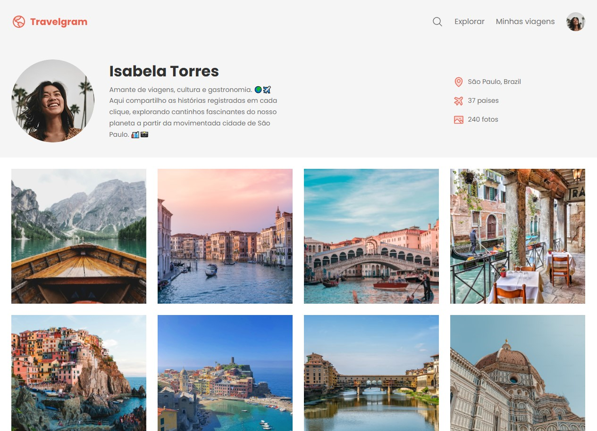

# Travelgram | Perfis de Viagem

<p align="center">
  
</p>

Projeto de uma página de perfil de viagens com visual clean, galeria de imagens e layout responsivo.

## ✈️ Sobre o projeto

Este projeto foi desenvolvido para apresentar um perfil de viajante com:

- banner de perfil
- navegação superior
- lista de informações pessoais
- galeria de fotos de viagens
- rodapé com links úteis

## 🛠️ Tecnologias

- HTML5
- CSS3
- Google Fonts
- Arquivos locais de imagem

## 📁 Estrutura

```text
.
├── assets/
├── styles/
├── index.html
├── README.MD
└── .vscode/
```

## ▶️ Como abrir

acesse: `https://lucas072-cpu.github.io/perfil-de-viagens/`

## 📌 Observação

O projeto é um exercício de front-end para praticar HTML e CSS com foco em layout e apresentação visual.
